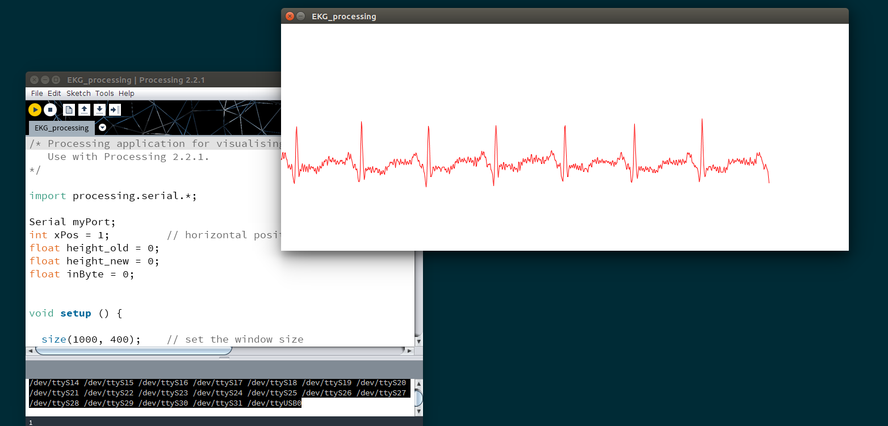

# EKG
Arduino Nano based ECG monitor.

An electrocardiogram (ECG or EKG) is a record of the electrical activity of the heart over a period of time. It is done by electrodes attached to the chest.

An electrocardiogram is used to monitor human heart. With electrocardiogram medical doctor can diagnose various heart conditions.

## How does it work?
An ECG module with three electrodes are attached to the person's chest. Device measures electrical activity of the heart and draws electrocardiogram on a computer.

Three electrodes are the following:
 * red R = RA (right arm)
 * green R = LA (left arm)
 * yellow L = RL (right leg)

Electrodes should be connected to the human chest the following way:

## Materials needed
 * ECG module (AD8232) with electrodes
 * ECG lead patch
 * Adruino Nano

## Wiring
ECG module - Arduino Nano:
 * GND - GND
 * 3.3V - 3.3V
 * OUTPUT - A1
 * LO- - D11
 * LO+ - D10
 * SDN  not connected

## Software needed
Software part of the device consist of two parts. First you need to upload the Arduino firmware (*EKG.ino*) to the device.

Then you should run [Processing 2.1.1](https://processing.org/download/). Open the PDE sketch (*EKG_processing.pde*) and run it. Please note, that the following sketch does not work with newer versions of Processing. Please also note that while running Processing, you should not use serial connection to Arduino with some other application, because Processing needs to communicate with Arduino via serial connection.

Processing application uses ttyUSB0 device on Linux. If you are using different serial device, you should change the value of myPort variable (replace "/dev/ttyUSB0" with your device name).

Applicaton alsi lists all the available serial ports. List is shown below Processing mail window, so you can easily find out which serial devices are present on your system.

